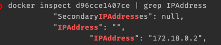

### Docker Info

If some error occurs due to already running containers, volumes, images.

To remove all Docker images, containers, and volumes, you can use the following commands:

Remove all containers:
```bash
docker rm -f $(docker ps -a -q)
```
Remove all volumes:
```bash 
docker volume rm $(docker volume ls -q)
```

Remove all images:
```bash
docker rmi -f $(docker images -q)
```

Note: Be cautious when using these commands, as they will forcefully remove all containers, images, and volumes without any confirmation. Make sure you don't have important data in your containers or volumes before executing these commands.

More info: [External Blog post](https://www.digitalocean.com/community/tutorials/how-to-remove-docker-images-containers-and-volumes)


### POSTGRESQL

#### Launch postgres database on local.
```console
docker-compose -f ./devops/docker-compose/common.yml -f ./devops/docker-compose/postgres_setup.yml up 
```

### setup
`mydatabase` is the database created when you launch the containers based on `docker_postgres_init.sql` file.
CommandLine to connect postgresql using psql client:
`docker exec -it postgres_container psql -U admin -d mydatabase`
(Note: If psql client is not installed on your machine, please install it. For example for homebrew package manager : `brew install libpq`)

- Click on Add server and give any name e.g. PgAdmin demo

  

- Add Connection details.
  - To get host name or address of the postgres container running, use the following commands. 
   ```console
   docker ps
   docker inspect 94d2afc27546 | grep IPAddress
   ```
  

- Add connection:
  Enter the Host= ip address obtained in previous step. Add username=`admin` and password = `root`. Click save. 
  

  - The final result will be like shown below:
  - 
  


For more information explore the Github repository published at: https://github.com/asaikali/docker-compose-postgres
or blog: https://www.danvega.dev/blog/2023/07/17/pgadmin-docker-compose/


### KAFKA
### Launch Zookeeper
```console
docker-compose -f ./devops/docker-compose/common.yml -f ./devops/docker-compose/zookeeper.yml up 
```

### Launch kafka cluster
```console
docker-compose -f ./devops/docker-compose/common.yml -f ./devops/docker-compose/kafka_cluster.yml up 
```

### Launch kafka creation of topic via init_kafka 
```console
docker-compose -f ./devops/docker-compose/common.yml -f ./devops/docker-compose/init_kafka.yml up 
```